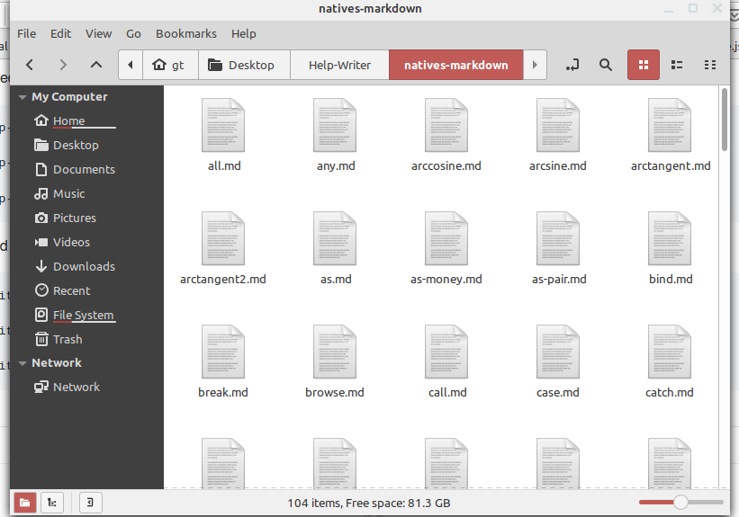

 

# help-writer

Writes help-string content for `any-function!` types to Asciidoc, LaTex, Markdown, or HTML files.

From the Red language help system.

### Usage

* Interpreted

```red
./red help-writer.red function! asciidoc

./red help-writer.red action! latex

./red help-writer.red -a, --all markdown

./red help-writer.red op! html
```

* Compiled 

```red
./help-writer native! asciidoc

./help-writer routine! latex

./help-writer -a, --all markdown

./help-writer op! html
```

----


----


----

