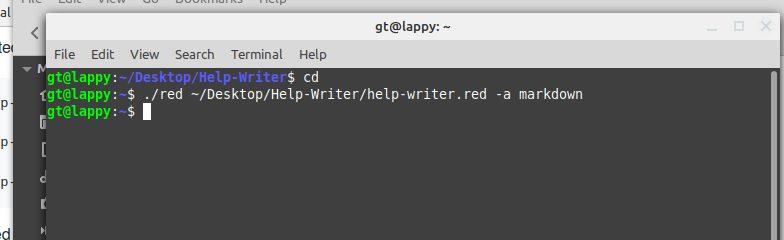
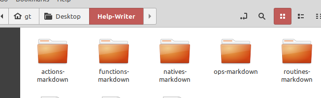

# help-writer

Writes help-string content for `any-function!` types to asciidoc, markdown, or LaTex files.

From the Red language help system.

### Usage

* Interpreted

```
./red help-writer.red function! asciidoc

./red help-writer.red action! latex

./red help-writer.red -a, --all markdown
```

* Compiled 

```
./help-writer native! asciidoc

./help-writer routine! latex

./help-writer -a, --all markdown
```

----


----


----
